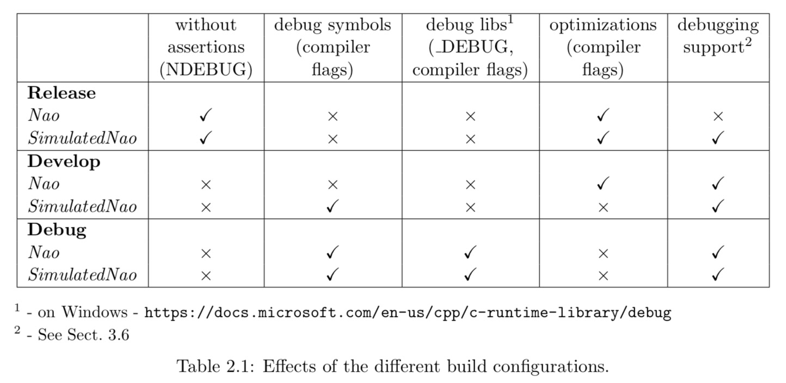

# 2.2 组件和配置（Components and Configurations）

B-Human软件可以在Windows、Linux和macOS上使用。它由在真实机器人上运行的两个NAOqi共享库、一个额外的机器人可执行文件、在模拟器SimRobot上运行的相同软件(没有NAOqi)以及一些库和工具组成。因此，本软件分为以下几个部分：

**bush** ，是一个可以同时部署和管理多个机器人的工具(参看10.2节)。

**Controller** ，是一个静态库，它包含模拟器的特定于NAO的扩展，是机器人代码框架的接口，它也是控制和高级调试运行在NAO上的代码所必需的。

**copyfile**  ，是一个将编译后的代码复制到机器人的工具。更详细的解释见第2.5节。在Xcode项目中，这称为部署。

**libbhuman** ，是B-Human可执行文件用来与NAOqi交互的共享库。

**libgamectrl** ，是一个与GameController通信的共享NAOqi库。另外，它实现了官方按钮接口，并按照规则中指定的方式设置led。更多资料见第3.1节末尾。

**libqxt** ，是一个静态库，它为Windows和Linux上的Qt提供了一个额外的小部件。在macOS上，相同的源文件只是库控制器的一部分。

**Nao** ，是B-Human可执行文件。这取决于libbhuman和libgamectrl。

**qtpropertybrowser** ，是一个静态库，它在Qt中实现了一个属性浏览器。

**SimRobot**  ，是运行和控制b人机器人代码的模拟器可执行程序。它动态链接到组件SimRobotCore2、SimRobotEditor、SimulatedNao和一些第三方库。SimRobot在发布(Release)、开发(Develop)和调试(Debug)配置中都是可编译的。所有这些配置都包含调试代码，但是Release执行一些优化并去掉调试符号(Linux和macOS)。当链接到不可调试但更快的发布库时，Develop生成可调试的机器人代码。

**SimRobotCore2** ，是一个共享库，它包含SimRobot的仿真引擎。

**SimRobotEditor** ，是一个共享库，其中包含模拟器的编辑器小部件。

**SimulatedNao** ，是一个共享库，其中包含模拟器的B-Human代码。它依赖于Controller、qtpropertybrowser和libqxt。它是静态连接的。

所有组件都可以在Release, Develop, and Debug这三种配置中构建。Release版是为“游戏代码”而设计的，因此能够实现最高的优化;Debug提供了完整的除错支持，没有优化。Develop是一个特例。它为组件Nao和SimulatedNao生成带有一些调试支持的可执行文件(有关更具体的信息，请参见下表)。对于所有其他组件，它与Release是相同的。

Nao和SimulatedNao的不同配置见表2.1。

