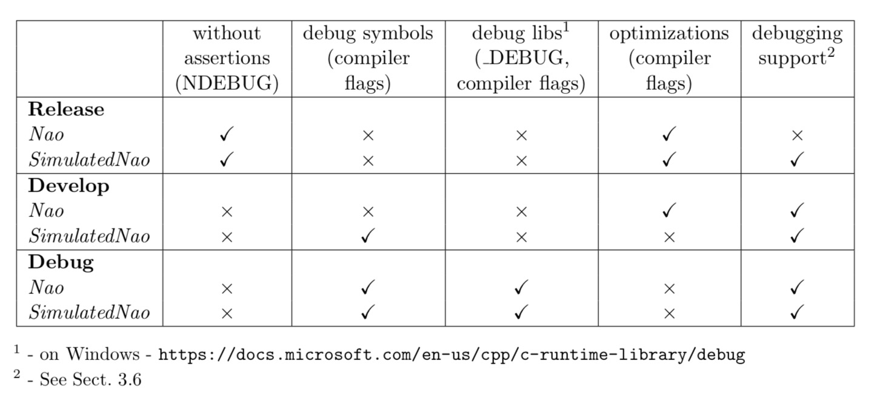

# 2.3 Building the Code

## 2.3.1 项目代（Project Generation）

脚本生成(或生成)。在Make/<OS/IDE>目录中生成编译组件所需的平台或IDE特定文件。脚本收集所有需要的源文件、头文件和其他资源，并将它们打包到与您的系统匹配的解决方案中(例如，Visual Studio项目和Windows的解决方案文件、Linux的CodeLite项目和macOS的Xcode项目)。在打开任何IDE或启动任何构建过程之前都必须调用它，并且无论何时从项目中添加或删除文件，都必须再次调用它。在Linux上，使用CodeLite时需要生成脚本。通过所提供的Makefile从命令行构建代码，无需在Linux上调用generate。

表2.1:不同构建配置的影响。

## 2.3.2 Visual Studio on Windows

此处略过。

## 2.3.3 Xcode on macOS

### 2.3.3.1所需的软件（Required Software）

需要下列组成部分:

+ macOS 10.12 or later 
+ Xcode 8.3 or later 
+ alcommon -为了从c++ SDK 2.1.4 Linux 32 (naoqi-sdk-2.1.4.13-linux32.tar.gz)中提取所需的alcommon库和兼容的boost头文件，可以使用B-Human软件附带的Install/installAlcommon脚本。必须手动下载所需的包并将其交给脚本。可以通过https://community.ald.softbankrobotics.com(需要帐户)获得。请注意，此包仅用于编译实际NAO机器人的代码。还要注意installAlcommon需要扩展名.tar.gz。如果NAOqi存档是在下载之后部分解压的，例如通过Safari，那么在执行脚本之前重新打包它。

### 2.3.3.2 编译（Compiling）

通过执行Make/macOS/ Generate生成Xcode项目（Xcode必须在接受其许可并安装其组件之前至少执行过一次）。打开Xcode项目Make/macOS/B-Human.xcodeproj。许多方案(可在工具栏中选择)允许在配置中构建SimRobot调试、开发和发布，以及所有三种配置中NAO的代码(参看2.2节，请注意，交叉编译器实际上是为Linux构建代码，尽管该方案说的是“My Mac”)。对于这两个目标，开发都是一个不错的选择。此外，还可以构建B-Human用户Shell轴套。

在构建NAO时，成功的构建将打开一个对话框，将代码部署到机器人上(使用copyfiles脚本，参见2.5节，在此之前，必须首先设置NAO(参见2.4节))。如果之前使用登录脚本登录到NAO，则默认提供所使用的IP地址。另外，默认情况下提供选项-b，该选项将在部署NAO后重新启动B-Human软件。选择的IP地址和指定的选项都将在下次使用deploy对话框时被记住。IP地址存储在文件Config/ scene /Includes/connect中。这也是由登录脚本编写的，并由RemoteRobot模拟器场景使用。这些选项存储在Make/macOS/copyfiles-options.txt中。一个特殊的选项是-a:如果指定了该选项，则部署对话框在将来不再显示。相反，前面的设置将被重用，即构建代码将自动部署它，而不需要询问任何问题。若要恢复对话框，请在对话框正常显示时按住Shift键。

### 2.3.3.3 对Xcode的支持（Support for Xcode）

调用脚本Make/macOS/generate还可以安装很多对Xcode的开发支持：

数据格式器（Data formatters）。如果各自的文件还不存在，则创建一个符号链接到格式化程序，以便Xcode调试器显示几个特征数据类型的摘要。

源文件模板（Source file templates）。Xcode的上下文菜单项新文件…包含一个类别BHuman，允许创建一些特定于b - human的源文件。

代码片段（Code snippets）。有许多代码片段允许按照B-Human的编码风格以及一些B-Human宏添加标准构造。

源代码格式化程序（Source code formatter）。系统为格式文本服务B-Human Xcode菜单的代码可以使用Xcode→服务。

## 2.3.4 Linux

### 2.3.4.1 安装依赖

下面的程序已经在Ubuntu 17.04 64位上测试并运行。它还可以用于其他Linux发行版(只要是64位的);但是，可能需要不同的或额外的包。

Ubuntu 17.04的要求(按通用包名列出)：

+ clang
+ qtbase5-dev
+ libqt5svg5-dev
+ libglew-dev
+ libxml2-dev
+ graphviz – graphviz -可选的，用于生成模块图和行为图。
+ xterm – 可选的，用于从B-Human用户shell bush中打开ssh会话。

+ alcommon – 为了从c++ SDK 2.1.4 Linux 32 (naoqi-sdk-2.1.4.13-linux32.tar.gz)中提取所需的alcommon库和兼容的boost头文件，可以使用随B-Human软件一起交付的Install/installAlcommon脚本。必须手动下载所需的包并将其交给脚本。可以通过https://community.ald.softbankrobotics.com(需要帐户)获得。请注意，此包仅用于编译实际NAO机器人的代码。

在Ubuntu 17.04上，你可以执行以下命令来安装除alcommon之外的所有需求：

`sudo apt install clang qtbase5 -dev libqt5svg5 -dev libglew -dev libxml2 -dev graphviz xterm`

### 2.3.4.2 编译

要编译2.2节中描述的组件(Copyfiles除外)，只需选择Make/Linux作为当前的工作目录和类型：

`make`构建整个解决方案或`make <component > [CONFIG=<configuration >]`构建单个组件。

清洁整个解决方案，使用：`make clean [CONFIG=<configuration >]`

作为替代方案，还支持集成开发环境CodeLite，其工作原理类似于Visual Studio for Windows (cf. section . 2.3.2.2)。

要使用CodeLite，执行Make/LinuxCodeLite/generate，然后打开B-Human.workspace。请注意，打开生成的工作区需要CodeLite 5或更高版本。旧版本可能会崩溃。最新报告的CodeLite兼容版本是10.0.0。

