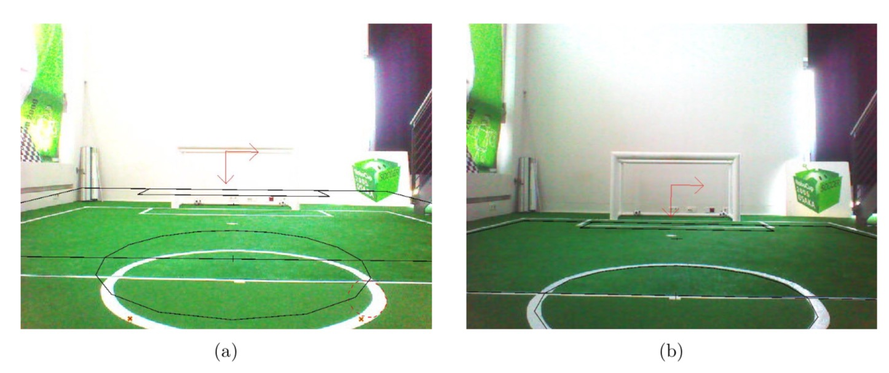
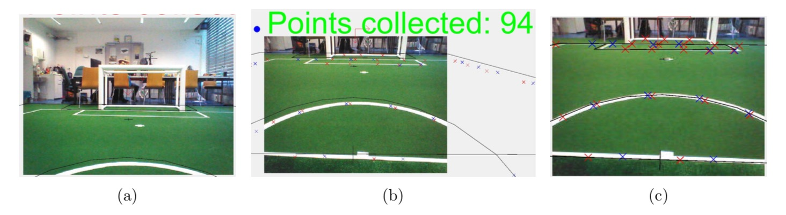
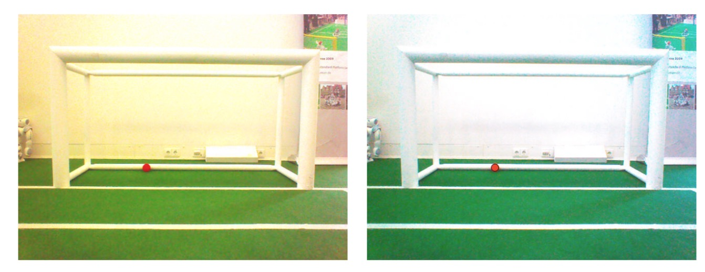

# 2.8 机器人校准（Calibrating the Robots）

正确校准的机器人非常重要，因为软件要求NAO的所有部件都在预期的位置。否则，NAO将无法稳定行走，从图像坐标投影到世界坐标(反之亦然)将是错误的。

一般来说，很多计算都是不可靠的。

NAO的两个物理组件可以通过SimRobot进行校准，关节(参看2.8.2节)和摄像机(参看2.8.3节)。经常检查这些校准是很重要的，特别是对关节来说。

新的机器人配备了校准的关节，理论上可以开箱即用。然而，随着时间的推移和使用，关节会磨损。尤其是髋关节。除此之外，B-Human软件还使用四种颜色类(参考4.1.4节)，这些颜色类也需要校准(参考2.8.4节)。改变位置或光照条件可能需要对其进行调整。

## 2.8.1 整体物理校准（Overall Physical Calibration）

物理校准过程可以分为三个步骤，总体目标是一个直立和直立的机器人，以及一个正确校准的相机。

第一步是让双脚处于一个平面的位置。这并不意味着机器人必须站直。这是通过把机器人抬起来，这样就可以看到脚的底部。然后改变脚和腿的关节偏移量，直到两脚都是平面的，两腿平行。两条腿之间的距离可以在腿的灰色部分测量。它们之间的距离应该是10厘米。

第二步是相机校准(参看2.8.3节)。这个步骤还可以测量身体相对于脚的倾斜程度。该测量可用于第三步，以改进关节的校准和机器人的扶正(参看第2.8.2节)。在某些情况下，可能需要重复这些步骤，因为联合校准中的大变化可能使相机校准无效。

## 2.8.2 关节校准（Joint Calibration）

该软件支持两种关节校准方法，1.通过手动调整每个关节的偏移量，2.通过使用使用逆运动学的关节校准模块来做同样的事情(参看8.3.4节)。整个校准过程的第三步(参考2.8.1节)只能通过接头校准器完成。在这两种方法之间切换时，需要保存接头校准，重新部署NAO，重启bhuman。否则，前面做的更改将不会生效。

在改变关节偏移量之前，机器人必须处于固定关节角度的站立位置。否则，运动引擎的平衡机构可能会移动腿，打乱关节的校准。使用以下方法来设置：

`get representation:MotionRequest`，然后在返回的语句中设置motion = stand。

校准完成后记得保存，`save representation:JointCalibration`。

##### 手动调整接头偏差（Manually Adjusting Joint Offsets）

首先，机器人必须切换到一个固定的支架上，否则运动引擎的平衡机械手可能会移动机器人的腿，打乱关节的校准：`mr StandArmRequest CalibrationStand`，`mr StandLegRequest CalibrationStand`

有两种方法来调整关节偏移量：

1. 用get命令要求进行接头校准：`get representation:JointCalibration`修改返回的校准，然后设置它。
2. 使用数据视图(参考section 10.1.4.5)，`vd representation:JointCalibration`哪个更舒服。

接头校准还包含了各接头不应更改的其他信息!

##### 使用联合校准器（Using the JointCalibrator）

首先设置接头校准器，提供接头校准器并切换到校准台：`call Calibrators/Joint`

当需要全新校准时，可对接头校准进行复位：`dr module:JointCalibrator:reset`

然后，可以修改脚的平移和旋转。再次与：`get module:JointCalibrator:offsets`或：`vd module:JointCalibrator:offsets`

***平移的单位是毫米，旋转的单位是度。***

##### 把NAO弄直（Straightening Up the NAO）

相机校准(参考2.8.3节)还计算身体旋转的旋转。这些值可以传递给接头校准器，然后将NAO设置在垂直位置。命令：

```c
get representation:CameraCalibration 
call Calibrators/Joint
```



<center>图2.1:校准程序(a)之前和(b)之后的投影线</center>

将bodyRotationCorrection(表示摄像校准)的值复制到bodyrotate(表示关节校准)中。然后，设置车身旋转校正(表示凸轮校正)为零。使用带有自动化标志的AutomaticCameraCalibrator或多或少地自动完成这些操作的另一种方法是可能的(参见2.8.3节)。

最后一步是在同一时间调整双脚的移动(大部分时间是在同一方向)，使它们垂直于躯干下方。直线激光对这项任务非常有用。当全部操作完成时，通过执行下面的命令来保存校准：

```c
save representation:JointCalibration 
save representation:CameraCalibration
```

然后重新部署NAO并重新启动bhuman。

## 2.8.3 摄像头校准（Camera Calibration）

使用AutomaticCameraCalibrator模块校准相机(参考4.1.2.1节)，请遵循以下步骤:

1. 将模拟器连接到赛场上的机器人，并将其放置在指定的位置(罚球线位置)。
2. 运行SimRobot配置文件Calibrators/Camera.con(in the console type `call
   Calibrators/Camera`)。这将初始化校准过程，并进一步将命令或帮助打印到稍后将需要的模拟器控制台。
3. 使用AutomaticCameraCalibrator模块(例如，将机器人的位置设置为一个字段的罚分，输入set模块:AutomaticCameraCalibrator:robotPose rotation = 0;平移= {x = -3200;y = 0;};在控制台)。
4. 若要自动生成以下关节校准的命令以纠正身体旋转，可通过以下方式设置标志:`set module:AutomaticCame
   raCalibrator:setJointOffsets true`，优化完成后，只需输入生成的命令，从而纠正旋转。



<center>Figure2-2,三个有趣的相机校准阶段。a)为校准器的起点。b)为控件从采集的样本开始后的视图。c)为优化后的阶段。</center>

5. 要启动点集合，请使用命令`dr module:AutomaticCameraCalibrator:start`，然后等待输出"Accumulation finished. Waiting to optimize. . . "，这个过程包括两个摄像头，采集样本进行校准，头部运动覆盖整个场地。上面相机的样本是蓝色的，下面相机的样本是红色的。如果样本数量足够优化(绿色)或不足够优化(红色)，则图像上方的绘图将进行签名。
6. 如果您对某些特定示例的集合不满意，现在可以通过左击找到示例的图像中的示例来删除示例。如果缺少一些示例，您可以通过Ctrl +左键单击将它们手动添加到相应的图像中。
7. 使用自动校准程序：`dr module:AutomaticCameraCalibrator:optimize`，然后等待优化收敛。

## 2.8.4 颜色校准（Color Calibration）

校准颜色类分为两个步骤。首先，相机驱动程序的参数必须根据环境的需要进行更新。命令:`get representation:CameraSettings`，将返回当前设置。

此外，将生成必要的set命令。最重要的参数是：

**whiteBalanceTemperature：** 使用白平衡。可用区间为[2700,6500]。

**exposure：** 所使用的接触。可用区间为[0,1000]。通常，使用140的曝光，等于14毫秒。请注意，高曝光会导致图像模糊。

**gain：** 所使用的增益。可用区间为[0,255]。通常，增益设置为50 - 70。请注意，高增益值会导致噪声图像。

**autoWhiteBalance：** 启用(1)/禁用(0)自动白平衡。此参数应始终禁用，因为白平衡中的更改可能会更改颜色并打乱颜色校准。另一方面，环境色温的真实变化也会产生同样的结果。

**autoExposure：** 启用(1)/禁用(0)自动曝光。在标准室内锦标赛等静态灯光条件下进行比赛时，应始终禁用此参数，因为自动化往往会选择高于需要的值，从而导致图像模糊。然而，对于2016年机器人世界杯户外比赛中出现的动态光环境，使用相机驱动程序的自动化可能是必要的。在这种情况下，可以使用参数autoExposureAlgorithm和亮度来改变其行为。



<center>2-3左图显示的是一幅白平衡不正确的图像。右边的图显示了相同的图像，但白色平衡的设置更好。</center>

相机驱动程序可以做一次自动白平衡。该功能可以通过以下命令触发：

```c
dr module:CameraProvider:doWhiteBalanceUpper 
dr module:CameraProvider:doWhiteBalanceLower
```

在设置好相机驱动程序的参数后，必须更新color类的参数(cf. section . 4.1.4)。为此，需要使用分割的上下摄像头图像和颜色校准视图打开视图，见(参看第10.1.4.1节和第10.1.4.1节)。

完成color类校准并保存当前参数后，可以使用copyfiles/bush (cf. section . 2.5)来部署当前设置。

确保更新了文件cameraSettingsV5。(或cameraSettingsV4 cfg。cfg如果NAO是V4模型)和fieldColorsCalibrationV5。cfg(或fieldColorsCalibrationV4.cfg)存储在正确的位置。