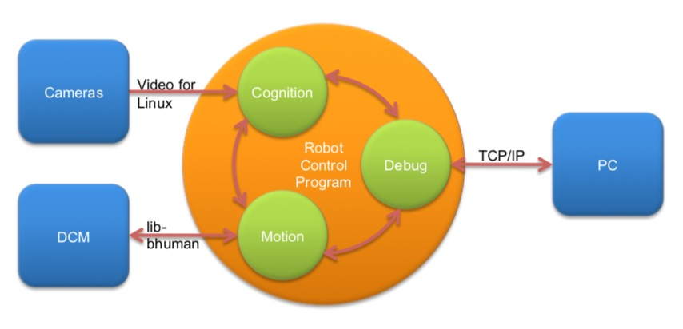

# 3.2 进程（Processes）

大多数机器人控制程序使用并发进程。并行进程的数量最好由机器人本身或其操作系统的外部需求决定。NAO以30赫兹的频率提供每个相机的图像，并在100赫兹时接受新的关节角。处理摄像机图像,会有两个选择:要么有两个流程每个流程的两个摄像头的图像和第三个收集图像处理的结果和执行世界建模和行为控制,或者是有一个过程,交替过程两个摄像机的图像,也进一步执行所有步骤。我们使用后一种方法，因为每个进程间通信可能会给系统增加延迟。由于两个相机的图像都经过了处理，所以这个单一的处理过程以60hz的速度运行。此外，还有一个以NAO的运动帧速率运行的过程，即在100hz。为了调试，另一个进程执行与主机PC的TCP通信。

图3.1:NAO上使用的进程

这导致了B-Human系统中使用的认知、运动和调试三个过程(参见图3.1)。Cognition接收来自Linux视频的摄像头图像，以及来自进程运动的传感器数据。它处理这些数据并将高级运动命令发送回进程运动。这个过程实际上是通过生成NAO的25个关节的目标角度来执行这些命令的。它通过libbhuman将这些目标角度发送给NAO的设备通信管理器，并接收传感器读数，如实际关节角度、加速度、陀螺测量值等。，提供航迹推算的结果。进程调试与主机PC机通信。它将从它接收到的数据分发给其他两个进程，并收集它们提供的数据并将其转发回主机。在实际的比赛中它是不活跃的。

在所描述的体系结构意义上的流程可以实现为实际的操作系统流程，也可以实现为线程。在NAO和模拟器中，使用线程。相比之下，在B-Human过去在Humanoid League的团队中，框架进程被映射到操作系统的实际进程(即Windows CE)。为了一致性，我们将在本文中使用术语“processes”。

