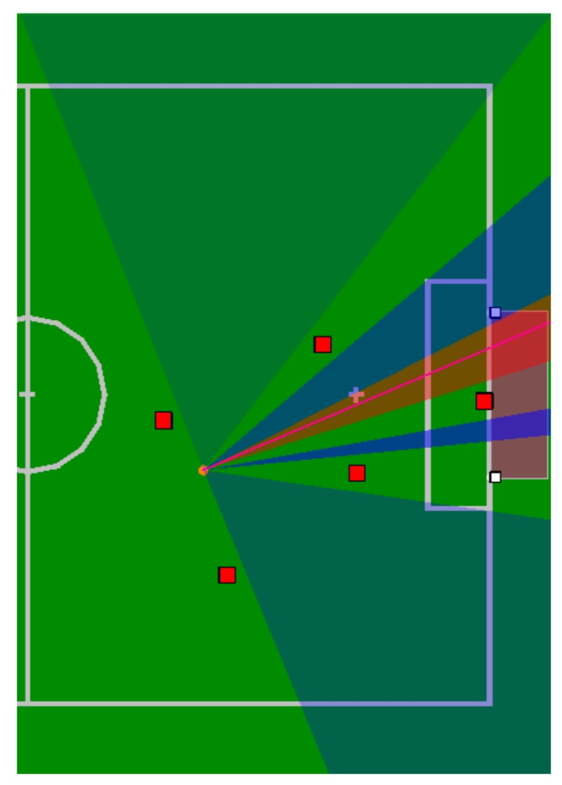

# 6 Behavior Control

B-Human系统中执行动作选择的部分称为行为控制。它也在过程认知的语境中运行。该行为使用基于c的代理行为规范语言(CABSL)建模。主要模块——行为控制——提供了许多表示，这些表示要么控制机器人的动作，要么发送给队友。它还附带了几个额外的模块，如VGPathPlanner (cf. 6.4)、KickPoseProvider (cf. 6.5)、CameraControlEngine (cf. 6.6)、LEDHandler (cf. 6.7)以及RoleProvider (cf. 6.2.1)。

本章首先简要概述行为规范语言CABSL，以及如何以一种简单的方式使用它。然后，展示如何建立一个新的行为。两个问题都通过实例加以澄清。这一章的主要内容是对B-Human在2017年机器人世界杯上使用的全部足球行为进行详细的解释。

## 6.1 CABSL

CABSL是一种设计用来将代理的行为描述为状态机的层次结构的语言，它是我们几年前使用的状态机行为引擎(cf.[24，第5章])的派生。CABSL完全由c++预处理器宏组成，因此可以使用普通的c++编译器进行编译。

要使用它，了解它的一般结构是很重要的。在CABSL中，使用以下基本元素:[选项、状态、转换、操作]。

行为由一组排列在选项图中的选项组成。只有一个启动选项，从该选项调用所有其他选项;这是选项图的根。

每个选项都是一个有限状态机，描述行为的特定部分，如机器人的技能或头部运动，或者它结合了这些基本特征。

每个选项从它的初始状态开始。在一个状态中，可以执行一个操作，该操作可以调用另一个选项，也可以执行任何c++代码，例如修改行为控件提供的表示。此外，在每个状态中都有一个转换部分，可以在该部分中决定转换到另一个状态(在选项中)。和操作一样，转换也能够执行c++代码。

```cpp
option(exampleOption) 
{
    initial_state(firstState) 
    {
        transition
        {
            if(booleanExpression)
                goto secondState;
            else if(libExample.boolFunction())
                goto thirdState; 
        }
        action
        {
            providedRepresentation.value = requiredRepresentation.value * 3;
        } 
    }
    state(secondState) 
    {
        action
        {
            SecondOption();
        } 
    }
    state(thirdState) 
    {
        transition
        {
            if(booleanExpression)
            goto firstState; 
        }
        action
        {
            providedRepresentation.value = RequiredRepresentation::someEnumValue;
            ThirdOption();
        }
    }
}
```

选项中的特殊元素是公共转换以及目标状态和中止状态。

公共转换由一直被检查的条件组成，独立于当前状态。它们是在选项的开头定义的。状态内的转换是公共转换的“else- branch”，因为如果不满足公共转换，则只计算它们。

目标状态和中止状态的行为与正常状态类似，只是调用选项可以检查被调用的选项当前是执行目标状态还是中止状态。如果调用选项在转换到另一种状态之前应该等待被调用选项完成，那么这将非常方便。这可以通过使用特殊符号done和aborted操作来实现。

注意，如果在同一个操作块中调用了两个或多个选项，那么只可能检查最后调用的选项是否达到特殊状态。

```cpp
option(exampleCommonTransitionSpecialStates) 
{
    common_transition 
    {
        if(booleanExpression) 
            goto firstState;
        else if(booleanExpression) 
            goto secondState;
    }
    initial_state(firstState) 
    {
        transition
        {	
            if(booleanExpression)
                goto secondState; 
        }
        action
        {
            providedRepresentation.value = requiredRepresentation.value * 3;
        } 
    }
    state(secondState) 
    {
        transition
        {
        if(action_done || action_aborted)
            goto firstState; 
        }
        action
        {
            SecondOption();
        } 
    }
}

option(SecondOption) 
{
    initial_state(firstState) 
    {
        transition
        {
            if(boolean_expression)
                goto targetState; 
            else
                goto abortedState; 
        }
    }
    target_state(targetState) 
    {
    }
    aborted_state(abortedState) 
    {
    }
}
```

此外，选项可以具有可以像普通函数参数那样使用的参数。参数的规范使用了与我们系统中的流式数据类型定义相同的语法。因此，每个选项的实际参数可以记录在日志文件中，也可以显示在行为对话框中(cf. Fig. 6.2)。请注意，图6.2中所示的源代码仍然为c++编译器所理解，因此也为c++ ide的编辑器所理解。

## 6.2 Behavior Used at RoboCup 2017

这种行为分为两部分，“身体控制”和“头部控制”。“身体控制”部分是行为的主要部分，通过做出决定和调用各自的选项来处理所有的游戏情况。它还负责设置[HeadControlMode]，然后由“HeadControl”使用[HeadControlMode]来移动第6.2.7节中描述的头部。这两个部分在行为的主要选项Soccer中都被调用，如果按下机器人的胸部按钮，该选项还会处理机器人最初的站立动作;如果按下胸部按钮三次，该选项还会处理机器人坐下的动作。

“BodyControl”部分从一个名为HandlePenaltyState的选项开始，该选项确保机器人在受到惩罚时静止不动，并监听胸部按钮，手动对机器人进行惩罚和取消惩罚。如果机器人没有受到惩罚，则调用选项HandleGameState，如果初始、设置或已完成的某个gamestates处于活动状态，则该选项将确保机器人保持静止。在“就绪”状态下，它将调用选项ReadyState，该选项允许机器人走到它们的起始位置。
当处于“play”状态时，将调用一个名为PlayingState的选项来处理不同的游戏情况。首先，它处理在它自己的章节中详细描述的启动情况(参看第6.2.6节)。此外，它还检查在调用角色选择(cf. section . 6.2.1)之前是否必须处理所有机器人行为相同的特殊情况(cf. section . 6.2.1)，在这个角色选择中，每个机器人都被选择为不同的角色之一(cf. section . 6.2.1)。

特殊情况有:

+ StopBall，如果球被踢向机器人的方向，它会试图通过挡道来接住球，并执行一个特殊的动作来阻止它。
+ TakePass，如果前锋决定传球给机器人，机器人会立即转向球的方向，并尝试传球。
+ SearchForBall，如果全队有一段时间没有看到球了，球员们就会转身去找它。在转弯时，机器人将头部对准FieldCoverageProvider提供的位置(参看5.4节)。如果整个转弯后没有观察到球，则每个机器人巡逻到GlobalFieldCoverageProvider提供的位置(参看5.4节)。这还包括一个特殊的处理球出去。

### 6.2.1 Roles and Tactic（角色和策略）

我们的行为目标是防守风格的比赛和最小的运动。这可以防止对手运球进入我们的球门，节省电池电量。除此之外，它还可以防止关节发热，从而减少关键时刻所需的关节刚度/运动质量。为了做到这一点，我们使用了以下阵容:

1. 一个守门员（Keeper）:守门员机器人。
2. 两名防守队员（Defenders）:机器人的防守位置，帮助守门员防守自己的球门。
3. 一个前锋（Striker）:踢球的机器人。
4. 一个支持者（Supporter）:一个机器人，在进攻位置帮助前锋。

在少于五个机器人的阵容中，至少有一个机器人应该是后卫。角色选择由RoleProviderRoyale完成。一般的流程是，每个机器人都在为自己和每个相连的队友计算角色选择建议，但使用队长机器人的角色选择。队长机器人是由最低(不处罚)连接的队友号决定的。这一过程背后的原因是总是有一个可用的建议，但抑制了机器人在同一时间扮演不同角色的机会。

守门员的角色总是分配给编号为1的机器人，在任何时候都不会改变。前锋的角色将分配给机器人，机器人可以最快的到达球。计算将有利于目前的前锋，以防止振荡。所有其他可用的机器人现在将分配到两个后卫角色和一个支持者角色。为了决定哪个机器人成为支持者，哪个机器人成为防守者，全局x位置将用于支持前一个角色。如果机器人的数量超过守门员和前锋的数量，那么将至少分配一名后卫。

### 6.2.2 Striker

### 6.2.3 Supporter

### 6.2.4 Defender

### 6.2.5 Keeper

### 6.2.6 Kickoff

### 6.2.7 Head Control

## 6.3 Penalty Shoot-out Behavior（罚球行为）

## 6.4 Path Planner（路径规划）

### 6.4.1 Approach（方法）
### 6.4.2 Avoiding Oscillations（避免振荡）
###6.4.3 Overlapping Obstacle Circles（障碍物圆重叠）
###6.4.4 Forbidden Areas（禁止区域）
### 6.4.5 Avoiding Impossible Plans（避免不可能的计划）

## 6.5 Kick Pose Provider（踢位提供器）

为了计算踢向对手目标的最优位置，使用了一个名为kick - PoseProvider的模块。大多数情况下，至少有一部分球门被对手的机器人覆盖。因此，我们需要计算出从球的角度看，球门开口角度最大的部分(cf. Fig. 6.6)。这部分的中心将是我们踢球的目标。



<center>图6.6:从球上看到的对手机器人之间的所有开口(红色方块)的可视化。红色的开口被选为射门目标。</center>

现在我们需要选择踢哪个球。对于每一个可能的踢腿动作，该模块都要求机器人提供踢腿所需时间的信息，以及机器人对球的偏移量，包括旋转偏移量。旋转偏移量定义了机器人的方向和目标方向之间的角度。基于这些信息，该模块计算每个踢腿动作的踢腿姿态，即机器人必须站在的位置和执行踢腿时必须面对的方向。然后，对每个姿势进行评估，找出可能的最佳姿势。

不同体位的评估主要基于执行时间，执行时间包括到达体位的时间和实际踢腿的时间。此外，还要考虑踢出的球是否足够有力以达到对手的目标。为了影响选择的概率，可以修改执行时间。例如，如果踢是相当不稳定的，并且应该只在机器人已经站在一个近乎完美的位置时使用，则可以通过增加配置的执行时间来降低选择踢的概率。

有些案件需要特别处理。在我们自己的禁区内，我们只使用快速任意球，不使用步行任意球。在对方禁区内，则是相反的选择。当球靠近对方球门柱或在对方罚球区一侧时，使用一种特殊的侧踢。

## 6.6 Camera Control Engine（摄像头控制引擎）

CameraControlEngine根据BehaviorControl2015提供的HeadMotionRequest进行修改，提供HeadAngleRequest，用于设置实际的head angle。该模块的主要功能是确保所请求的角度是有效的。此外，它还提供了使用所谓的PanTiltMode(用户可以手动设置所需的头部角度)或目标模式的可能性。

在目标模式下，CameraControlEngine获取用户提供的现场目标，利用逆运动学计算所需头部角度(cf. section . 8.3.4)。还必须确保摄像机尽可能多地覆盖现场。因此，相机控制器计算出最适合给定目标的相机，并相应地设置角度。而且，由于这个原因，大多数情况下提供的目标不会在任何相机图像的中间。

## 6.7 LED Handler

机器人的led用于显示关于机器人内部状态的信息，这在调试代码时非常有用。

##### Right Eye

|        Color        | Role      | Additional information                        |
| :-----------------: | --------- | --------------------------------------------- |
| Magenta（品红色的） | All       | 机器人连接外部电源(只有在没有led头的情况下)。 |
|        Blue         | Keeper    |                                               |
|        White        | Defender  |                                               |
|        Green        | Supporter |                                               |
|       Yellow        | Bishop    |                                               |
|         Red         | Striker   |                                               |

##### Left Eye 

| Color  | Information                                               |
| ------ | --------------------------------------------------------- |
| Yellow | No ground contact （不接触地面）                          |
| White  | Ball was seen（球被看见）                                 |
| Blue   | Field Feature was seen（可以看到现场特征）                |
| Red    | Ball and Field Feature were seen （可以看到球和场地特征） |

##### Torso (Chest Button) 躯干(胸部按钮)

| Color  | State             |
| ------ | ----------------- |
| Off    | Initial, finished |
| Blue   | Ready             |
| Green  | Playing           |
| Yellow | Set               |
| Red    | Penalized（处罚） |

##### 脚

+ 左脚显示团队颜色。例如，如果当前的团队是红色的团队，那么LED的颜色就是红色。如果团队颜色是黑色，这个LED将被关闭。
+ 右脚是球队是否开球的标志。开球时LED为白色，开球时LED为关闭状态。罚球时LED为绿色，机器人为点球手，守门员为黄色。

##### 耳朵

+ 右耳显示机器人电池电量。每损失10%的电池，LED就会关闭。
+ 左耳显示通过无线连接的播放器数量。对于每个连接的播放器，两个led被打开(左上，左下，右下，右上)。没有游戏控制器访问，两个led闪烁，其余的关闭。

##### 头(如果可用)

如果机器人在充电，led灯会一个接一个的打开和关闭。由于led的圆形排列，这看起来像一束旋转的光束。如果没有这些led灯，机器人正在充电，右眼会变成紫红色。

