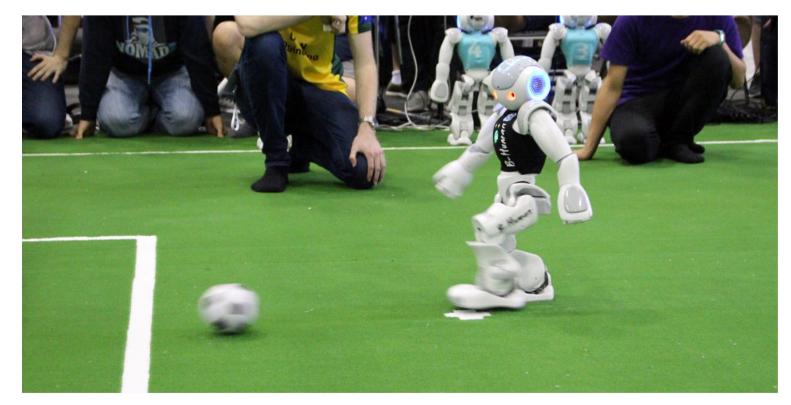
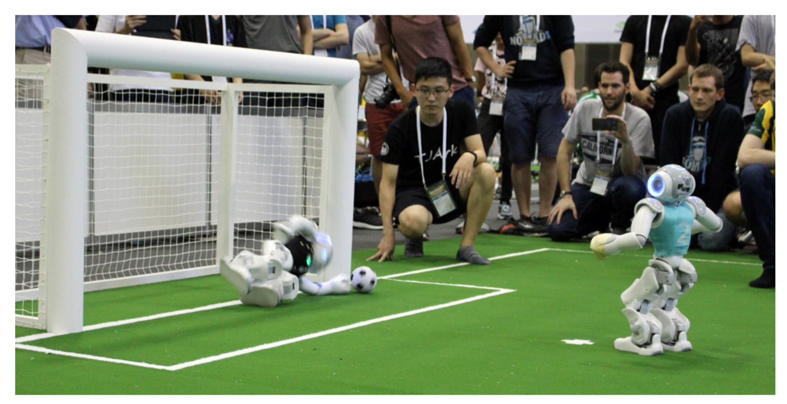

# 9.1 Penalty Shot Challenge

由于罚球也是正常比赛规则的一部分，所以在6.3中详细描述的标准行为对于罚球者和守门员都是积极的。

在2016年，我们已经有了成功的点球行为，使得我们在2016年机器人世界杯决赛中以3:0的比分(在正常比赛中是0比0)赢得了点球大战。点球手三次射门都进了球，守门员保住了一次射门(对方点球手的两次射门都失败了)。然而，技术上的挑战是进一步改进这些行为的强烈动机。

罚球手改进的重点是可靠性。我们的目标是尽可能地在两个球门柱的其中一个附近的一个位置反复地投篮。结果，我们的罚球手在罚球挑战中每次尝试都成功得分，在4场比赛中打入8球。图9.1展示了其中一种尝试。我们没有做任何努力来缩短从开始尝试到踢出点球之间的时间，尽管这是平局的一个标准。

对于守门员来说，提高自己的反应能力是最重要的，因为在离球门很近的点球点，球被踢出后的时间不多了。因此，必须尽早检测到踢球及其方向，避免出现误报。此外，最后的阻挡姿势必须达到高速。我们的守门员现在的速度和可靠性足以阻挡所有的射门，以中速踢。最后一场挑战赛的一个例子如图9.2所示。由于它的反应，我们的守门员在整个比赛中只让两个球通过。然而，应该注意的是，我们的守门员没有(还)快，以赶上我们的罚球手的射门，因为他们太快，因此没有足够的时间来达到最后的阻挡姿势。

在联盟的网站http://spl.robocup.org/result-2017上可以看到比赛的概况。

图9.1:在对NomadZ的罚球挑战赛决赛中，B-Human点球手

图9.2:在对NomadZ的罚球挑战赛决赛中，B-Human点球门将挡球

